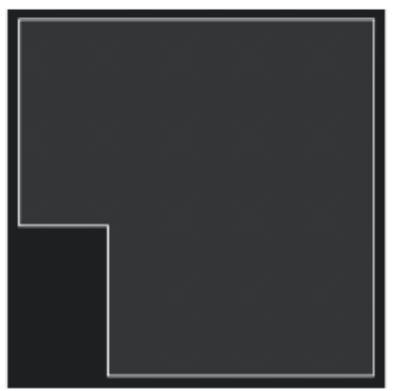

# Задача - Создать скрипт для вычисления координат точек

Необходимо из “сырых” данных получить координаты для построения SVG фигур

```
Длина, мм  |  Угол,
___________|_________
1665       |  0
947        |  90
557        |  0
1300       |  90
2225       |  180
2239       |  270
```



Нужно написать скрипт на JS/TS, который по углу и длине стены вычислит координаты вида:
Точка №1 - 0, 0
Точка №2 - 10, 0 и т.д.

Из-за масштаба при расчёте координат нужно перевести длину стен из мм в см.
<br>

## Реализация

1. Создан скрипт createSvgPath(), который даёт готовый аттрибут d для path;
2. Небольшая вёрстка и стили;

<br>

----

#### [ссылка на скрипт]()
